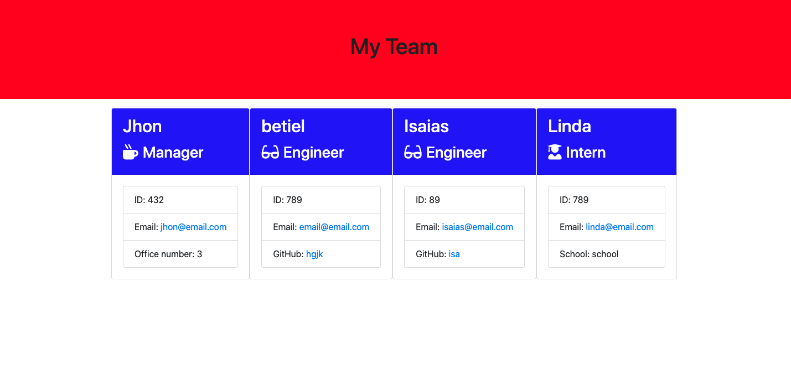
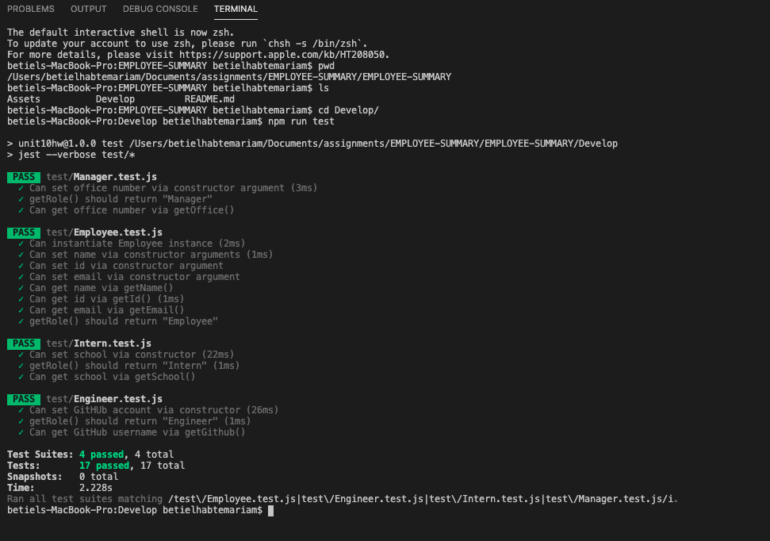

# Employee Summary

A command line application that will prompt the user for information about the team manager and then information about the team members. The user can input any number of team members, and they may be a mix of engineers and interns. All unit test of this applicatoin must pass. When the user has completed building the team, the application will create an HTML file that displays a nicely formatted team roster based on the information provided by the user. 


## User story


```
As a manager
I want to generate a webpage that displays my team's basic info
so that I have quick access to emails and GitHub profiles
```

## Screenshot of the final output



## Screenshot of the testing




## Testing

To run the test the user must input the following code in the command line. 

```
npm run test
```


## Installation

The user must use the following code to run the application

```
npm i
```

```
node app.js
```


### Deployment 

You are required to submit the following:

* The URL of the GitHub repository: https://github.com/betielbetu/EMPLOYEE-SUMMARY

* A video demonstrating the entirety of the app's functionality: https://drive.google.com/file/d/17t4J8UwOlICBpcg51mVn6uYhgEIzGJoN/view


- - -
© 2021 Trilogy Education Services, LLC, a 2U, Inc. brand. Confidential and Proprietary. All Rights Reserved.
